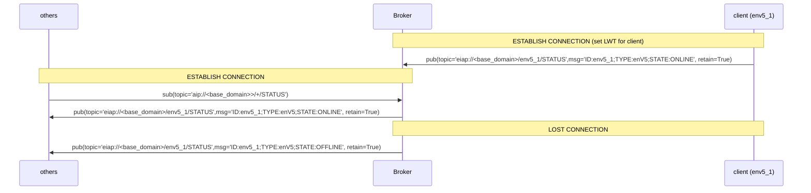
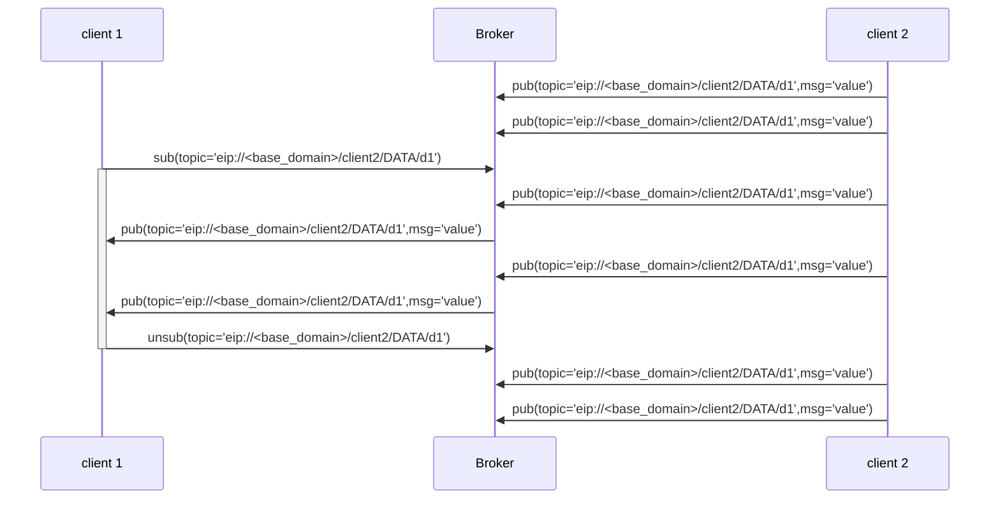
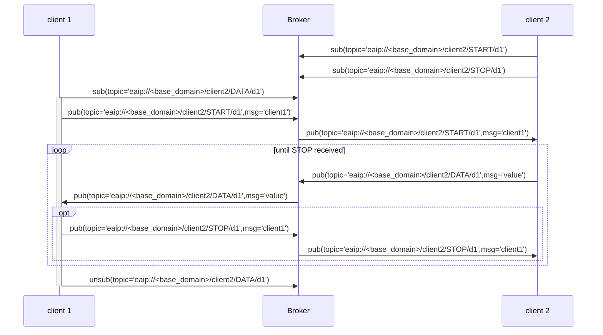
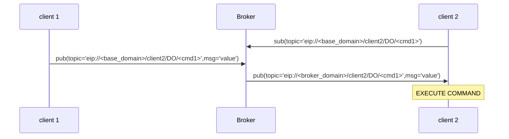
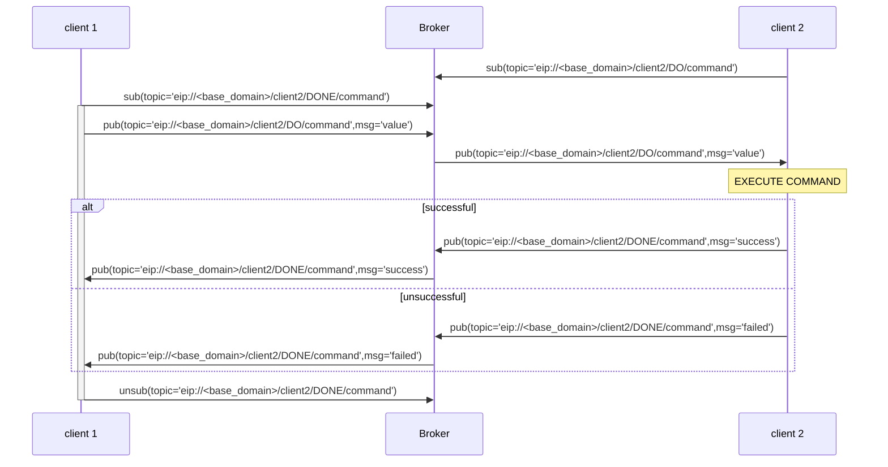

# elastic-AU Protocol

The elastic-AI protocol (EAIP) provides a specification of a pub-sub-protocol.
It is designed to work with MQTT, but this is **not** mandatory.
The basic functionalities provided are _subscribing_, _unsubscribing_ and _publishing_ to and from topics and topic filters, together with a keepalive mechanism in combination with a last will message (LWT).

## General Parts of a Pub-Sub-System

### Message

A topic combined with a payload forms a message that will publish to the given topic.

### Topic

The topic is constructed as follows:

```text
eiap://<base_domain>/<device_id>/<message_type>[/<type_dependent>]
```

- **base_domain**
  Unique domain identifying the EAIP Broker
- **device_id**
  Unique identifier of a participant (Device or Application)
- **message_type**
  Unique identifier of a specific protocol command, as described in [Message Types](#message-types).
- **type_dependent** [OPTIONAL]
  Additional information depending on the message type

## Message Types

|              Type | Description                                                                         |
| ----------------: | :---------------------------------------------------------------------------------- |
| [STATUS](#status) | a message containing the online(1)/offline(0) status and configuration of an object |
|   [START](#start) | a message requesting an object to start sending a stream of data                    |
|     [STOP](#stop) | a message requesting an object to stop sending a stream of data                     |
|     [DATA](#data) | a message containing data                                                           |
|       [DO](#data) | a message containing a command                                                      |
|     [DONE](#done) | a message containing the response to a DO message                                   |

### STATUS

- **Topic**\
   `eip://<base_domain>/<device_id>/STATUS`
  - `<device_id>`: identifier of the participant publishing its status
- **Message**
  - **Mandatory Fields**
    - `ID:<device_id>;`
      - `<device_id>`: identifier of the participant publishing its status
    - `TYPE:<device_type>;`
      - 'APP' for Application
      - 'enV5' for elastic Node Instances
    - `STATE:<device_state>;`
      - 'ONLINE'
      - 'OFFLINE'
  - **Additional Fields**
    - `<field_label>:<field_value>;`
- **Information**
  - The system sets the retain flag to assure status discovery for newly entered participants.
  - The offline message is automatically sent by the broker after a connection loss (LWT).
  - The order of the data fields is arbitrary and not defined

> [!NOTE] **Example message**
>
> **Online Message of a elastic Node instance:**
>
> ```text
> pub(topic="eiap://uni-due.de/es/client1/STATUS",msg="ID:client1;TYPE:enV5;STATE:ONLINE;DATA:timer,acceleration;")
> ```
>
> **Offline Message of a elastic Node instance (LWT):**
>
> ```text
> pub(topic="eiap://uni-due.de/es/client1/STATUS",msg="ID:client1;TYPE:enV5;STATE:OFFLINE;")
> ```

#### Communication Specification



### START

- **Topic**
   `eaip://<base_domain>/<device_id>/START/<data_id>`
  - `<device_id>`: identifier of the participant to request data from
  - `<data_id>`: identifier of the data to request
- **Message**
   `device_id` of the requesting participant
- **Information**
  - Provider subscribes to topic to receive requests
  - Provided `data_id` can be published with an additional status field

> [!NOTE] **Example message**
>
> ```text
> pub(topic="eaip://uni-due.de/es/client1/START/timer",msg="client2")
> ```

### STOP

- **Topic**
   `eaip://<base_domain>/<object_id>/STOP/<data_id>`
  - `<device_id>`: identifier of the participant to request data from
  - `<data_id>`: identifier of the data to request
- **Message**
   `device_id` of the requesting participant

> [!NOTE] **Example message**
>
> ```text
> pub(topic="eaip://uni-due.de/es/client1/STOP/timer",msg="client2")
> ```

### DATA

- **Topic**
   `eip://<base_domain>/<device_id>/DATA/<data_id>`
  - `<device_id>`: identifier of the participant publishing data
  - `<data_id>`: identifier of the data to request
- **Message**
   Value encoded as a string
- **Information**
  - Interested participants can subscribe to this topic to receive new data

> [!NOTE] **Example message**
>
> ```text
> pub(topic="eaip://uni-due.de/es/client1/DATA/light",msg="30.7")
> ```

#### Communication specification for

##### Continuously published data



##### Single shot request



### DO

- **Topic**
   `eip://<base_domain>/<device_id>/DO/<command>`
  - `<device_id>`: identifier of the participant publishing data
  - `<command>`: command to run
- **Message**
   command specific data

> [!NOTE] **Example message**
>
> ```text
> pub(topic="eaip://uni-due.de/es/client1/DO/led/01",msg="ON")
> ```

#### Communication specification for a command _without_ a response



### DONE

- **Topic**
   `eip://<base_domain>/<device_id>/DONE/<command>`
  - `<device_id>`: identifier of the participant publishing data
  - `<command>`: command to respond to
- **Data**
   command specific

> [!NOTE] **Example message**
>
> ```text
> pub(topic="eip://uni-due.de/es/client1/DONE/led/1",msg="ON")
> ```

#### Communication specification for a command _with_ response


